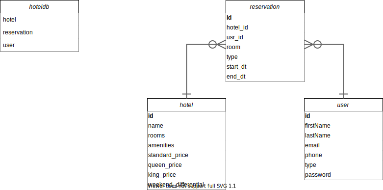

## Objectives

:::::: { .column style="text-align:left; width:100%" }
Develop software with the following features:
::::::

* Create/Modify Users Information
* Create/Modify Hotel Properties (Admin)
* Create/Modify Reservation information (modify or cancel reservation/Users & Admin)
* Ability to search based on criteria (price/date range, amenities, room availability)
* Have an intuitive UI/UX design

---

## How

:::::: { .column style="text-align:left; width:100%" }
Front-end
::::::

:::::: { .fragment style="Fade in" }
{width=200}
::::::

::: notes
React is an open-source, front end, JavaScript library for building user
interfaces or UI components.
:::

---

### ReactJS: `navBar`

:::::: notes
Point out a few of the features used from react.

* `navBar`.
::::::

---

### ReactJS: `searchBar`

:::::: notes
Point out a few of the features used from react.

* `searchBar`.
::::::

---

## How

:::::: { .column style="text-align:left; width:100%" }
Back-end
::::::

:::::: { .fragment style="Fade in" }
{ width=600 } 
::::::

::: notes
Nodejs:

* Node.js is an open-source, cross-platform, back-end JavaScript runtime
  environment that runs on the V8 engine and executes JavaScript code outside a
  web browser. Node.js lets developers use JavaScript to write command line tools
  and for server-side scripting—running scripts server-side to produce dynamic
  web page content before the page is sent to the user's web browser.

ExpressJS:

* Express is a minimal and flexible Node.js web application framework that
  provides a robust set of features for web and mobile applications. 
:::

---

### How

:::::: { .column style="text-align:left; width:100%" }
Database
::::::

:::::: { .fragment style="Fade in" }
{ width=600 }
::::::

::: notes
MYSQL via MariaDB:

* MariaDB is a community-developed, commercially supported fork of the MySQL
  relational database management system, intended to remain free and open-source
  software under the GNU General Public License. 
:::

---

### Database Schema

{ width=1000 }

::: notes
Primary Keys:  Bold/Underline \   
Secondary Keys: Bold \   

* For a _`reservation`_ to exist there must be at exactly one _`hotel`_ and
  _`user`_.

* _`reservation`_ is optional for _`hotel`_ to exist. There can be zero to many
  of them for a particular _`reservation`_.

* _`reservation`_ is optional for _`user`_ to exist. There can be zero to many
  of them for a particular _`reservation`_.
:::

