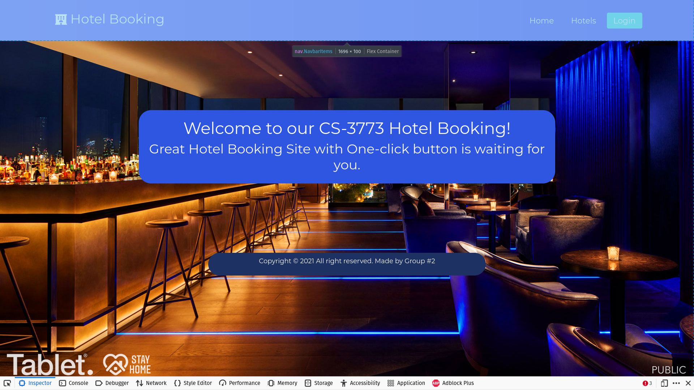
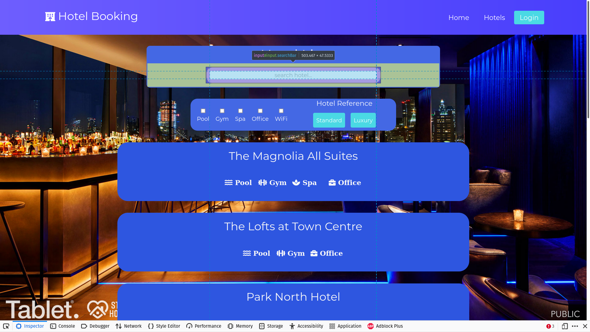
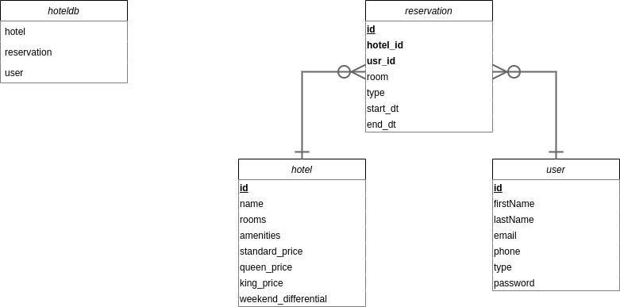
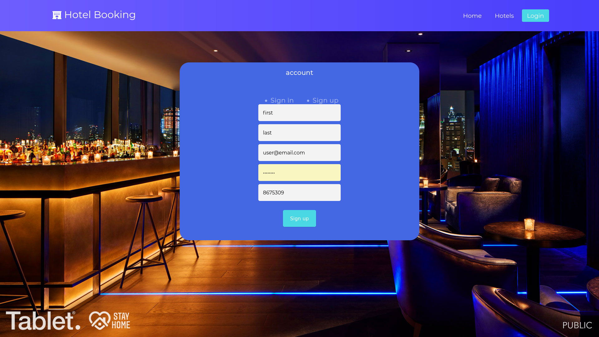
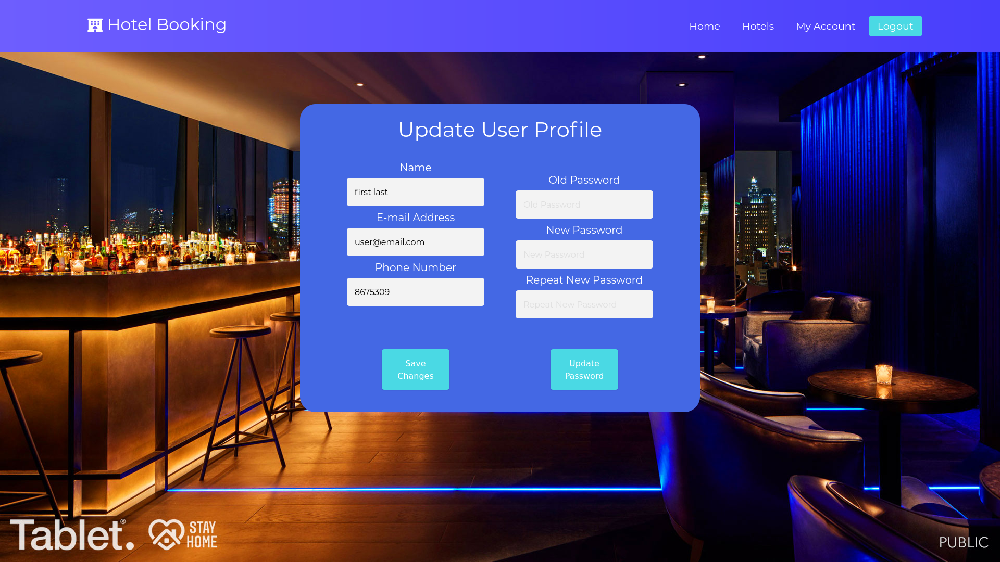
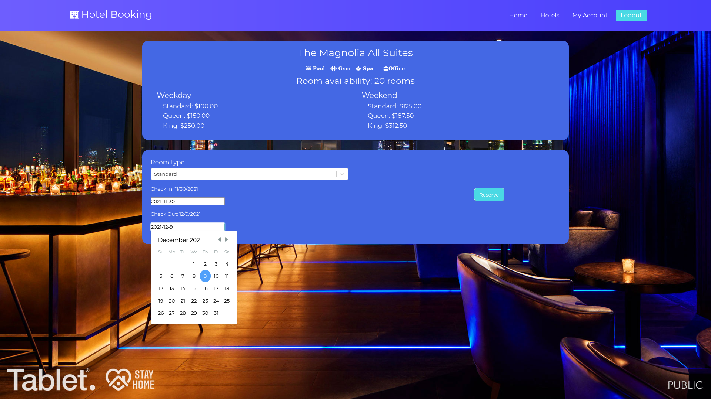
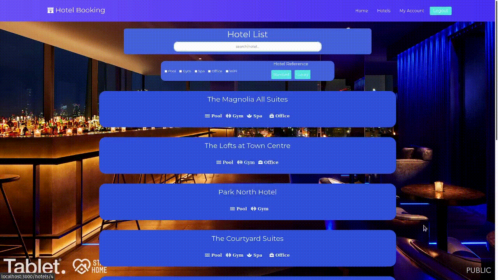

---
title:  'Term Project'
documentclass: extarticle
fontsize: 12pt
geometry:
- top=1in
- bottom=1in
- left=1in
- right=1in
- heightrounded
- margin=.6in
header-includes: |
    \hypersetup{pdftex,
            pdfauthor={William Burroughs},
            pdftitle={Term Project},
            pdfsubject={CS3773},
            pdfkeywords={CS3773, Software Engineering, Fall21}}
...

\begin{center}
William Burroughs \\
Loc Nguyen \\
Jonathan Villarreal \\
Maria Vanesa Rivera \\
Emilio Ibarra \\

\  

CS3773 - 001\\
Group 2 \\

\  

\today
\end{center}

\newpage

# Purpose of Project

Develop a software product that manages hotel reservations across a group of
hotels of varying characteristics.

## Objectives
Develop a software product with the following features:

* Create/Modify Users Information
* Create/Modify Hotel Properties (Admin)
* Create/Modify Reservation information (modify or cancel reservation/Users & Admin)
* Ability to search based on criteria (price/date range, amenities, room availability)
* Have an intuitive UI/UX design

## Major Milestones
* Design:
    - Complete all UI/UX development tasks.
\   
* Structural:
    - Complete all structural development tasks.
\   
* Testing:
    - Complete all tests.
\   
* Approval:
    - Client accepts product meets design specifications.

## Deliverables
* a web application that meets all requirements in key objectives.

## Scope exclusions
* Program does not read/write data from/to an external database.

\newpage

# Methodologies and Technologies Used

The following sections will discuss the technologies used (version control,
programming languages, frameworks/libraries, and additional tools).

## Programming languages

The project was made using the following programming languages. Percentages
were taken from github.

| **Language** | **Use %** |
| ------------ | --------- |
| JavaScript   | 89.1%     |
| CSS          |  9.0%     |
| HTML         | 1.8%      |
| TypeScript   | 0.1%      |

## Frameworks/libraries

### React

React is an open-source, front end, JavaScript library for building user
interfaces or UI components. React was used to create UI elements such as
navigation bar, search bar, and other components within the UI.

### Nodejs

Node.js is an open-source, cross-platform, back-end JavaScript runtime environment
that runs on the V8 engine and executes JavaScript code outside a web browser.
Node.js lets developers use JavaScript to write command line tools and for
server-side scripting—running scripts server-side to produce dynamic web page
content before the page is sent to the user’s web browser.

What follows are the significant node modules utilized in the project and a short description.

| Node Modules       | Description                                                                     |
|:-----------------: | :------------------------------------------------------------------------------ |
| `cors`             | CORS is a node.js package for providing a Connect/Express middleware            |
|                    | Connect is an extensible HTTP server framework for node used to handle requests |
|                    |                                                                                 |
| `react-router-dom` | React Router is a lightweight, fully-featured routing library for the React     |
|                    | JavaScript library. React Router runs everywhere that React runs; on the web,   |
|                    | on the server (using node.js), and on React Native.                             |
|                    |                                                                                 |
| `react-day-picker` | Flexible date picker component for React                                        |
|                    |                                                                                 |
| `bcrypt`           | A bcrypt library for Nodejs which helps hash passwords                          |
|                    |                                                                                 |
| `express`          | A minimal and flexible Node.js web application framework that provides a robust |
|                    | set of features for web and mobile applications.                                | 

\newpage

## Database

MariaDB is a community-developed, commercially supported fork of the MySQL
relational database management system, intended to remain free and open-source
software under the GNU General Public License. MariaDB was chosen for the
project due to the aforementioned reasons.

### Schema

\   

| **Key Type**     | **Identifier**    |
| ---------------: | :---------------- |
|   Primary Keys:  |  Bold/Underline   |
| Secondary Keys:  |  Bold             |

\   

* For a _`reservation`_ to exist there must be at exactly one _`hotel`_ and
  _`user`_.

* _`reservation`_ is optional for _`hotel`_ to exist. There can be zero to many
  of them for a particular _`reservation`_.

* _`reservation`_ is optional for _`user`_ to exist. There can be zero to many
  of them for a particular _`reservation`_.

### Other Technology

* Version control: `git` and github
* Database GUI:     MySQL workbench
* IDE/Text editors: Webstorm, Visual Studio Code, VIM

# Create/Modify Users Information 

## Create

## Modify

# Create/Modify Hotel Properties

For both the Modify hotel and Create hotel features, a React `useState` hook was
used to allow us to track the state for each function component. The `useState`
hooks allowed us to track the specific properties for the hotel such as name,
rooms available, pricing and amenities available. When creating a new Hotel the
properties where set to initially have an empty values. We created react forms
to take in the new corresponding properties for the hotels. We configured the
input types to match the hotel’s specific properties.

Furthermore, both Modify and Create hotel functionalities were configured to
only available to admin user accounts, using a credential validation function. 

## Create

## Modify

# Create/Modify Reservation information

## Create

## Modify

# Ability to search based on criteria

